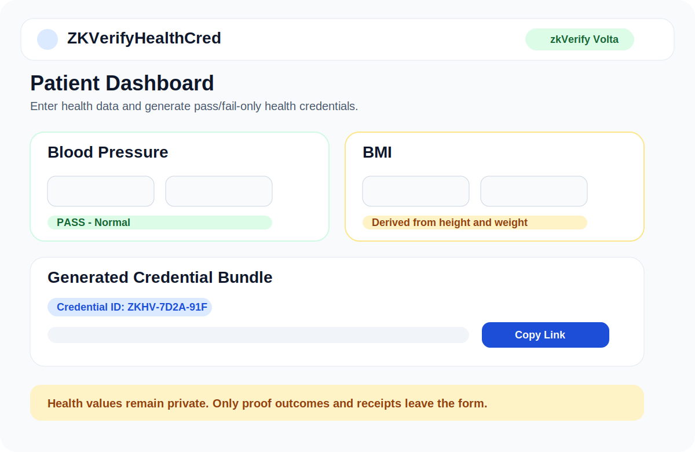
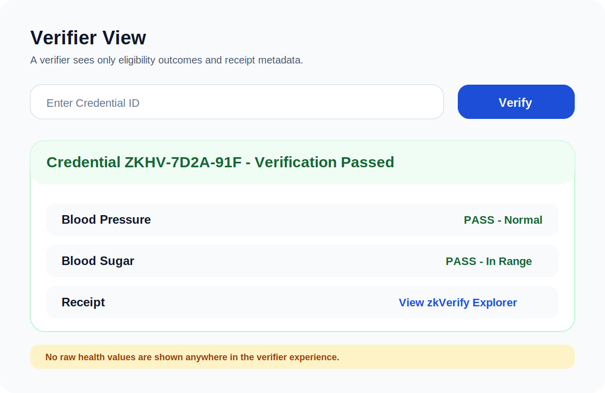
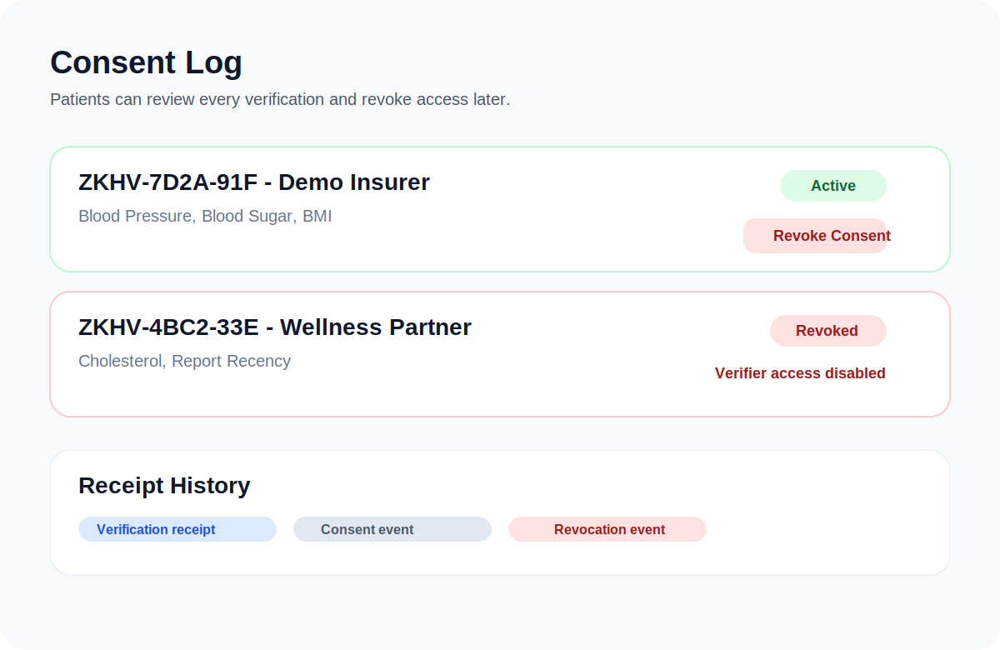

# ZKVerifyHealthCred


ZKVerifyHealthCred is a privacy-preserving health credential app that lets a patient prove health eligibility without exposing raw medical data.

Patients enter health metrics, the app evaluates them through zero-knowledge proof logic, and verifiers receive a pass/fail credential instead of the underlying values. The patient can then share, manage, and revoke access from one place.

## Screenshots

| Patient Dashboard | Verifier View | Consent Log |
| --- | --- | --- |
|  |  |  |

## What It Does

- Collects five health credential types:
  - Blood pressure
  - Fasting blood sugar
  - BMI
  - Cholesterol
  - Report recency
- Converts those inputs into proof-ready range checks
- Returns pass/fail-only credential outcomes
- Generates a shareable verification link
- Gives patients a consent history and revoke action

## Demo Flow

1. A patient signs in and enters health data.
2. The backend checks each credential against its allowed range.
3. The proof layer prepares Groth16-compatible proof data.
4. A credential bundle is created with pass/fail outcomes only.
5. The patient shares the verification link with a third party.
6. The verifier opens the link and sees eligibility results, not raw values.
7. The patient can later revoke consent and block future access.

## Product Highlights

- Privacy first: verifiers never need the actual medical numbers
- Shareable: each credential bundle can be sent as a verification link
- Revocable: patients remain in control after sharing
- zk-ready: built around Circom, Groth16, and zkVerify integration
- Demo-friendly: works locally with a fallback mode for fast testing

## Tech Stack

- Frontend: React, Vite
- Backend: Node.js, Express
- Zero-Knowledge: Circom, Groth16, `snarkjs`
- Verification Target: zkVerify
- Auth: simple email/password session flow
- Demo storage: JSON-backed local consent and user storage

## Architecture

- `frontend/`
  React UI for patient and verifier flows
- `backend/server.js`
  API for auth, proof generation, credential lookup, consent history, and revocation
- `backend/proof-generator.js`
  Health credential rules and proof pipeline
- `backend/zkverify-engine.js`
  zkVerify submission and receipt handling
- `circuits/healthrange.circom`
  Range-based Circom circuit for health checks

## Credential Types

### Blood Pressure

Checks systolic and diastolic values and returns a normal/elevated outcome.

### Fasting Blood Sugar

Checks whether glucose falls inside the accepted fasting range.

### BMI

Calculates BMI from height and weight, then checks whether it is in the target range.

### Cholesterol

Checks total cholesterol against the configured threshold.

### Report Recency

Checks whether a report is recent enough for verification.

## Privacy Model

The verifier does not see:

- Exact blood pressure values
- Exact glucose levels
- Exact cholesterol values
- Exact BMI inputs
- Exact report date details

The verifier does see:

- Credential identifier
- Credential labels
- Pass/fail results
- Verification or receipt metadata

## Local Development

### Backend

```bash
cd backend
npm install
node server.js
```

### Frontend

```bash
cd frontend
npm install
npm run dev
```

### Optional Circuit Setup

If you want real Groth16 circuit artifacts:

```bash
./scripts/setup-circuit.sh
```

## Deployment Notes

- Deploy the backend from `backend/`
- Deploy the frontend from `frontend/`
- Set `VITE_API_URL` for the frontend
- Configure zkVerify credentials in the backend environment for live proof submission

## Core Value

Prove eligibility, not the underlying health record.
